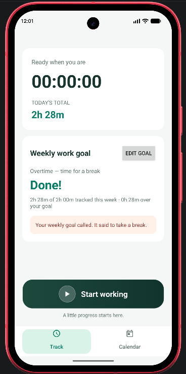
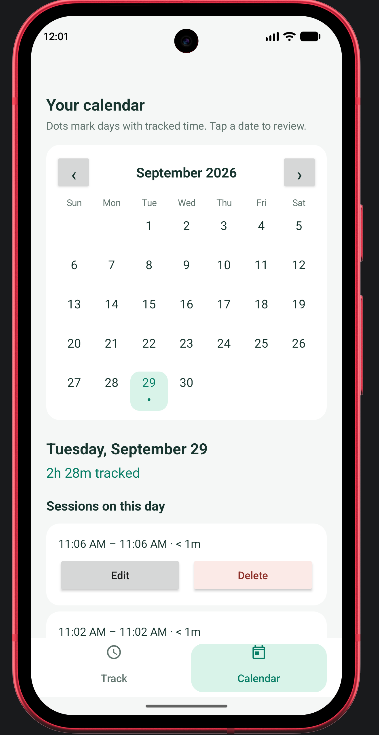

# TimeTrek

TimeTrek is an Android app for tracking work time and seeing how much of a weekly goal remains. It works without an account or a background timer service.

 

## Features

- **Track:** Start or finish a session with one large button. An active session keeps accruing time while the app is closed; its start timestamp is saved and elapsed time is calculated when you return.
- **Weekly goal:** Set the hours and minutes you need to work. The remaining-time display updates while tracking and shows **Done!** once the goal is met. The goal stays set; the tracked weekly total starts fresh each week.
- **Progress messages:** The goal card picks a message based on how much time remains, with playful reminders to take a break when you go into overtime.
- **Calendar:** Dots mark days with tracked time. Select a date to see its total and sessions; completed sessions can be edited or deleted.

Sessions that cross midnight or a week boundary contribute only their overlapping time to each day or week. Weeks follow the device's local calendar settings. Sessions and the weekly goal are saved on the device using Android `SharedPreferences` (and may be included in Android backup, depending on device settings).

## Build and test

Open the project in Android Studio with the Android SDK installed. The app supports Android 7.0 (API 24) and newer. You can also use the included Gradle wrapper:

```sh
./gradlew assembleDebug
./gradlew testDebugUnitTest
```

The debug APK is written to `app/build/outputs/apk/debug/app-debug.apk`. A debug APK is intended for development, **not** for publishing as a release.

## Publish a GitHub APK release

This project does not yet have automated release signing or a GitHub Actions release workflow. To publish a release manually:

1. Increase `versionCode` and update `versionName` in `app/build.gradle.kts`.
2. In Android Studio, choose **Build → Generate Signed App Bundle / APK → APK**, then build the **release** variant. On your first release, use **Create new** to make a signing keystore (`.jks`). Keep the keystore and its passwords outside this repository and make a secure backup. Use the **same signing key** for future updates.
3. Check the signed APK at the output location shown by Android Studio. Push the release's source changes to GitHub, then create a tag (for example, `v1.0`) under **Releases → Draft a new release** and attach the signed APK.

Alternatively, after pushing the code, publish the signed APK with GitHub CLI:

```sh
gh release create v1.0 "/path/to/signed.apk#TimeTrek-v1.0.apk" --generate-notes
```

Do not upload a keystore or passwords to GitHub. Running `./gradlew assembleRelease` without a release signing configuration is **not** a substitute for generating a signed APK.

## Code layout

| Path | Responsibility |
| --- | --- |
| `app/src/main/java/at/oderwieoderw/timetrek/ui/` | Activity navigation and display formatting |
| `app/src/main/java/at/oderwieoderw/timetrek/ui/tracking/` | Timer, weekly goal, and start/finish controls |
| `app/src/main/java/at/oderwieoderw/timetrek/ui/calendar/` | Calendar, day history, and session editing |
| `app/src/main/java/at/oderwieoderw/timetrek/domain/` | Time calculations and goal-progress stages |
| `app/src/main/java/at/oderwieoderw/timetrek/data/local/` | Local session and goal storage |
